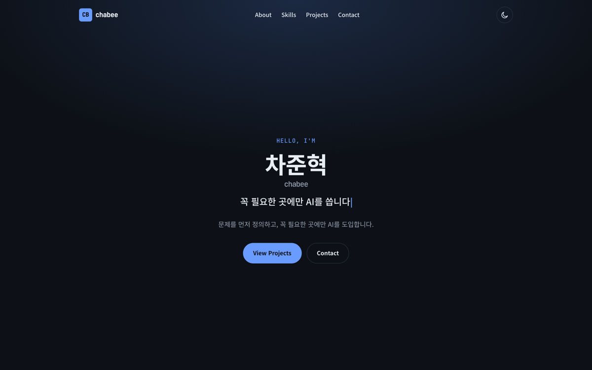
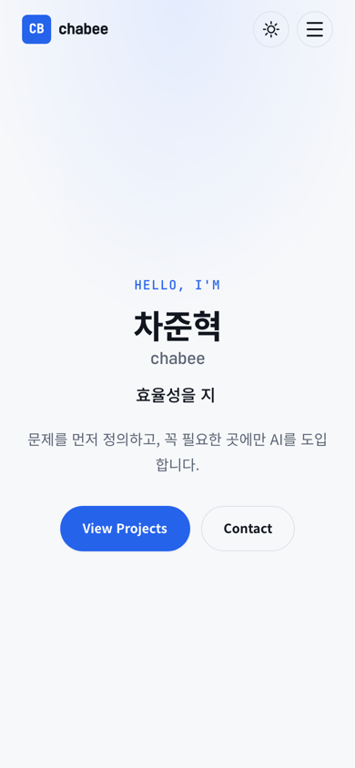

# B1-1: 나를 소개하는 웹페이지

HTML, CSS, JavaScript로 만든 개인 포트폴리오입니다. 별도 빌드 과정 없이 GitHub Pages에 올렸습니다.

**배포 주소:** https://chabeegees.github.io/Codyssey/B1-1/

## 화면

| 데스크톱 | 모바일 |
| --- | --- |
|  |  |

## 구현 내용

- 화면 크기에 따라 바뀌는 메뉴와 레이아웃
- 선택한 테마를 브라우저에 저장하는 다크 모드
- GitHub 공개 저장소를 가져와 보여주는 프로젝트 목록과 언어 필터
- 이름, 이메일, 메시지를 확인하는 문의 폼

프로젝트 목록은 `chabeegees`, `junhyeok-cha` 계정의 공개 저장소를 가져옵니다. 조직 계정에 있는 프로젝트 세 개는 별도로 조회해 목록 앞에 표시합니다. GitHub API 요청이 실패하면 오류 메시지와 다시 시도 버튼이 나옵니다.

문의 폼은 서버로 내용을 보내지 않습니다. 입력을 확인한 뒤 사용자의 메일 앱을 엽니다.

## 실행 방법

`B1-1/index.html`을 브라우저에서 열면 됩니다. 로컬 서버를 쓰려면 저장소 루트에서 아래 명령을 실행하세요.

```bash
python3 -m http.server 8000
```

그다음 `http://localhost:8000/B1-1/`에 접속하면 됩니다.

## 파일 구성

```text
B1-1/
├── index.html
├── css/style.css
├── js/
│   ├── state.js
│   ├── theme.js
│   ├── nav.js
│   ├── hero.js
│   ├── projects.js
│   └── form.js
└── images/
```

JavaScript 파일은 기능별로 나눴습니다. `state.js`에서 화면 상태를 관리하고, 나머지 파일에서 각 기능의 이벤트와 화면 표시를 처리합니다. 외부 라이브러리나 빌드 도구는 사용하지 않았습니다.
