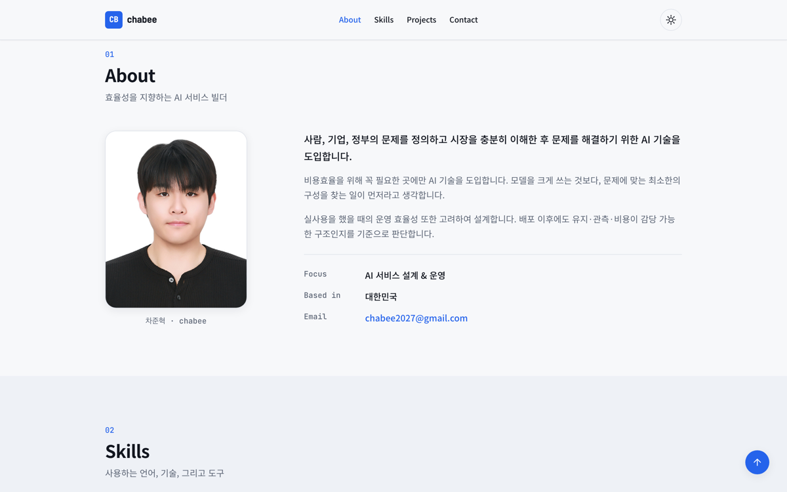
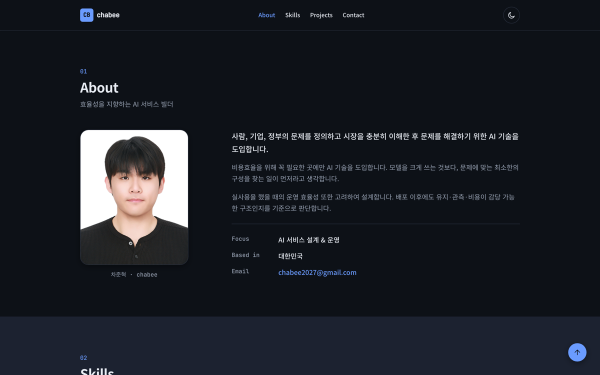
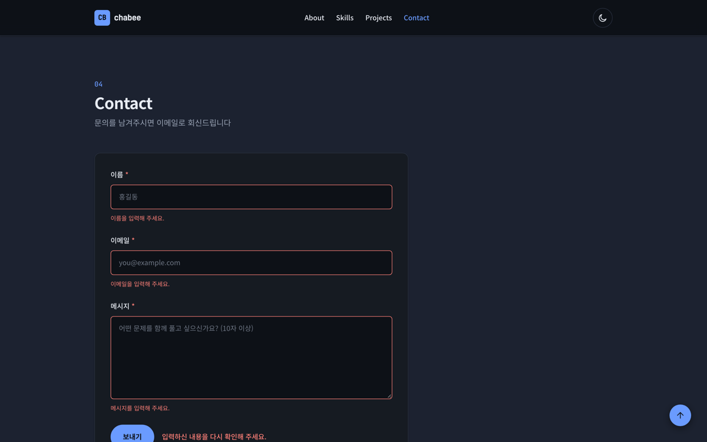
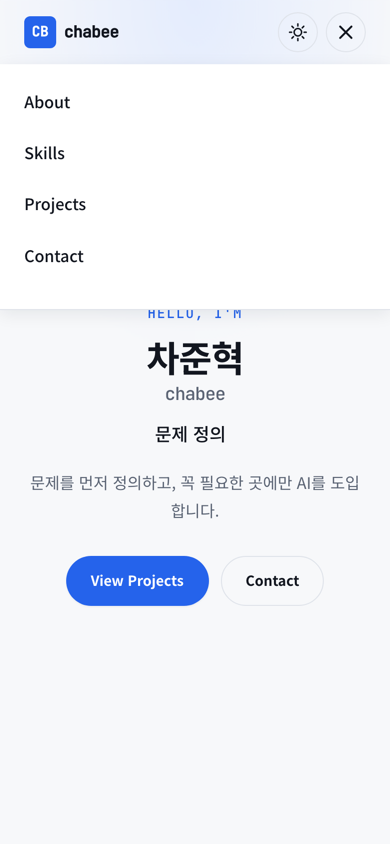
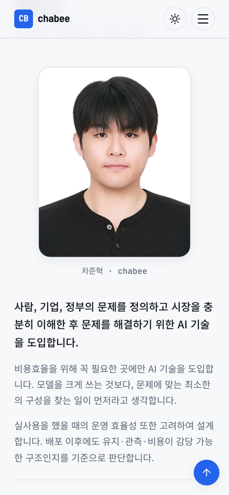
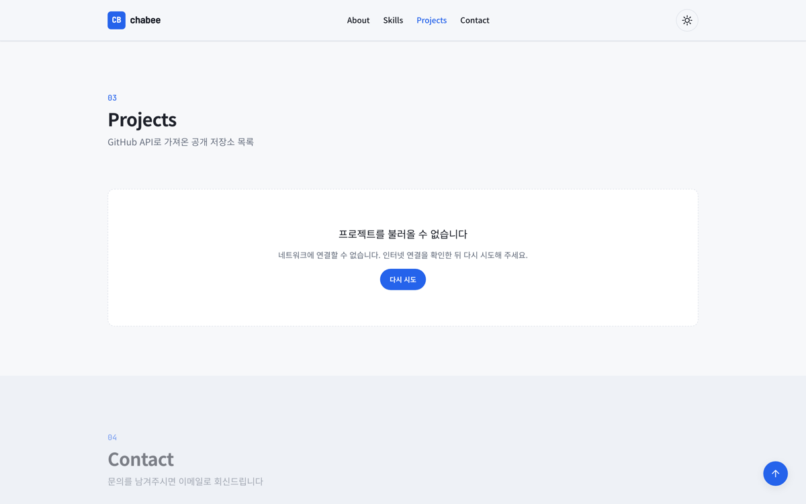

# B1-1 · 나를 소개하는 웹페이지

순수 HTML / CSS / JavaScript만으로 만든 반응형 포트폴리오 웹사이트입니다.
프레임워크, CSS 라이브러리, 빌드 도구를 전혀 쓰지 않았습니다.

**배포 URL** → <https://chabeegees.github.io/Codyssey/B1-1/>

---

## 목차

- [스크린샷](#스크린샷)
- [사용 기술](#사용-기술)
- [폴더 구조](#폴더-구조)
- [구현한 기능](#구현한-기능)
- [핵심 설계: 이벤트 → 상태 → 렌더링](#핵심-설계-이벤트--상태--렌더링)
- [과제 목표에 대한 답](#과제-목표에-대한-답)
- [설정값 정리](#설정값-정리)
- [로컬에서 실행하기](#로컬에서-실행하기)
- [알려진 제약](#알려진-제약)

---

## 스크린샷

### 데스크톱 (1440px)

| 다크 모드 — Hero | 라이트 모드 — Projects |
| --- | --- |
|  |  |

| 다크 모드 — About | 다크 모드 — 폼 유효성 검사 |
| --- | --- |
|  |  |

### 모바일 (390px)

| Hero | 햄버거 메뉴 | Projects |
| --- | --- | --- |
|  |  |  |

### API 에러 상태

네트워크가 끊기거나 GitHub API 요청 한도를 넘겼을 때의 화면입니다.



---

## 사용 기술

| 분류 | 내용 |
| --- | --- |
| 마크업 | HTML5 시맨틱 태그 (`header`, `nav`, `main`, `section`, `article`, `figure`, `footer`) |
| 스타일 | CSS3 — 커스텀 속성(`:root`), Flexbox, Grid, 미디어 쿼리, `transition`, `@keyframes` |
| 스크립트 | Vanilla JavaScript (ES6+) — `const`/`let`, 화살표 함수, 템플릿 리터럴, 구조분해 할당, `map`/`filter`/`forEach`, `async`/`await` |
| 브라우저 API | `fetch`, `IntersectionObserver`, `localStorage`, `matchMedia`, `FormData` |
| 외부 리소스 | Google Fonts (Noto Sans KR, JetBrains Mono) — 아이콘은 전부 인라인 SVG |
| 배포 | GitHub Pages |

**외부 라이브러리 의존성은 0개입니다.** `package.json`도, 빌드 단계도 없습니다.
브라우저가 `index.html`을 여는 순간이 곧 실행입니다.

---

## 폴더 구조

```
B1-1/
├── index.html              # 단일 페이지. 모든 섹션이 여기 있습니다
├── css/
│   └── style.css           # 전체 스타일 (토큰 → 레이아웃 → 컴포넌트 → 반응형 순)
├── js/
│   ├── state.js            # 상태 저장소 (setState / subscribe)
│   ├── theme.js            # 다크 모드
│   ├── nav.js              # 햄버거 메뉴, 스크롤 인터랙션, 스크롤 애니메이션
│   ├── hero.js             # 타이핑 효과 (보너스)
│   ├── projects.js         # GitHub API 연동, 카드 렌더, 언어 필터
│   └── form.js             # 문의 폼 유효성 검사
├── images/
│   ├── profile.jpg         # About 섹션 프로필 사진
│   ├── favicon.svg
│   └── screenshots/        # 이 README에 쓰인 이미지
└── README.md
```

파일을 기능 단위로 나눈 이유는, 하나의 파일을 열었을 때
"이 파일이 무엇을 책임지는가"를 한 문장으로 말할 수 있게 하기 위해서입니다.
`nav.js`는 스크롤과 메뉴만 알고, GitHub API가 있는지도 모릅니다.

### 스크립트 로딩

```html
<script defer src="js/state.js"></script>
<script defer src="js/theme.js"></script>
...
```

- `defer`를 쓴 이유: HTML 파싱을 막지 않으면서, 파싱이 끝난 뒤
  **작성한 순서대로** 실행됩니다. 덕분에 각 파일 맨 위에서
  `document.querySelector`를 바로 호출해도 요소가 이미 존재합니다.
- `type="module"`을 쓰지 않은 이유: 모듈은 `file://`에서 CORS 때문에 동작하지 않아,
  `index.html`을 더블클릭하는 것만으로는 실행되지 않습니다.
  대신 `state.js`가 만드는 전역 `App` 객체를 통해 파일 간 상태를 공유합니다.
- 각 파일은 즉시 실행 함수 `(() => { ... })()`로 감싸 내부 변수가
  전역을 오염시키지 않도록 했습니다. 밖으로 노출하는 것은 `App` 하나뿐입니다.

---

## 구현한 기능

### 레이아웃 & 반응형

- 모바일 퍼스트로 작성했습니다. 기본 CSS 규칙이 모바일이고,
  `@media (min-width: 768px)` / `(min-width: 1024px)`에서 넓은 화면용 규칙을 더합니다.
- 768px 미만에서는 네비게이션 메뉴가 숨겨지고 햄버거 버튼이 나타납니다.
- 768px 이상에서는 햄버거가 사라지고 메뉴가 가로로 펼쳐집니다.

### 인터랙션

| 기능 | 동작 |
| --- | --- |
| 햄버거 메뉴 | 클릭 시 `classList.toggle('active')`로 열고 닫습니다. 메뉴 항목·바깥 영역 클릭, `Esc` 키, 데스크톱 폭으로 확대 시 자동으로 닫힙니다 |
| 부드러운 스크롤 | CSS `scroll-behavior: smooth` + `scroll-padding-top`으로 고정 헤더에 제목이 가려지지 않게 했습니다 |
| 헤더 스타일 변경 | 스크롤 **60px** 초과 시 배경색·블러·테두리가 생깁니다 |
| 스크롤 탑 버튼 | 스크롤 **300px** 초과 시 나타나고, 클릭하면 `window.scrollTo({ behavior: 'smooth' })`로 맨 위로 이동합니다 |
| 스크롤 애니메이션 | `IntersectionObserver` **threshold 0.2** — 요소의 20%가 보이면 나타납니다. 한 번 보여준 요소는 `unobserve`로 관찰을 멈춥니다 |
| 현재 섹션 강조 | 화면 중앙을 지나는 섹션의 메뉴 항목에 강조 색이 들어갑니다 |
| 다크 모드 | 토글 시 `<html data-theme>`이 바뀌고, 선택값은 `localStorage`에 저장되어 새로고침 후에도 유지됩니다 |

### GitHub API 연동

두 계정(`chabeegees`, `junhyeok-cha`)의 공개 저장소를 `Promise.all`로 동시에 불러와
하나의 목록으로 합치고, 최근 업데이트 순으로 정렬합니다. 포크한 저장소는 제외합니다.

```js
const GITHUB_USERNAMES = ['chabeegees', 'junhyeok-cha'];
```

이 배열에 아이디를 넣고 빼는 것만으로 표시 대상이 바뀝니다.

**네 가지 상태가 모두 화면으로 구분됩니다.**

| 상태 | 화면 |
| --- | --- |
| `loading` | 스피너 + "프로젝트를 불러오는 중..." + 뼈대 카드 3장 |
| `success` | 언어 필터 버튼 + 저장소 카드 격자 |
| `error` | "프로젝트를 불러올 수 없습니다" + 원인 + **다시 시도** 버튼 |
| `empty` | "표시할 프로젝트가 없습니다" |

에러 원인은 상황에 맞게 다르게 보여줍니다.

- **403** → `GitHub API 요청 한도(시간당 60회)를 초과했습니다. 잠시 후 다시 시도해 주세요.`
- **404** → `'{계정}' 계정을 찾을 수 없습니다.`
- 네트워크 단절(`TypeError`) → `네트워크에 연결할 수 없습니다. ...`

### 폼 유효성 검사

| 필드 | 규칙 |
| --- | --- |
| 이름 | 필수, 공백 제외 2자 이상 |
| 이메일 | 필수, `/^[^\s@]+@[^\s@]+\.[^\s@]{2,}$/` 통과 |
| 메시지 | 필수, 공백 제외 10자 이상 |

- `novalidate`를 붙여 브라우저 기본 말풍선을 끄고, 직접 만든 에러 메시지를 씁니다.
  브라우저 기본 검증은 문구와 디자인을 제어할 수 없기 때문입니다.
- 제출 시 `event.preventDefault()`로 페이지 이동을 막습니다.
- 에러 메시지는 각 입력 필드 바로 아래에 표시되고, 필드 테두리도 빨간색으로 바뀝니다.
- **입력 중에는 이미 에러가 떠 있는 필드만** 다시 검사합니다.
  아직 건드리지도 않은 필드에 미리 빨간 줄을 긋는 것은 방해가 되기 때문입니다.
- 검증을 통과하면 성공 메시지를 표시하고, 정적 사이트에 백엔드가 없으므로
  입력값을 채운 `mailto:` 링크를 엽니다.

### 보너스로 구현한 것

- **언어별 필터링** — `Set`으로 중복 없는 언어 목록을 만들고 `filter()`로 걸러냅니다. 언어가 한 종류뿐이면 필터 자체를 숨깁니다.
- **타이핑 효과** — Hero에서 네 문구를 한 글자씩 쓰고 지웁니다.
- **시스템 다크 모드 감지** — 저장된 설정이 없으면 `prefers-color-scheme`를 따르고, 사용자가 직접 고른 적이 없다면 시스템 설정이 바뀔 때 함께 바뀝니다.

### 접근성

- 모든 이미지에 내용을 설명하는 `alt`를 넣었습니다.
- 모든 입력 필드는 `<label for>` ↔ `id`로 연결했습니다.
- 토글 버튼에 `aria-pressed`, 햄버거에 `aria-expanded`/`aria-controls`,
  에러 메시지에 `role="alert"`, 비동기로 바뀌는 Projects 영역에 `aria-live`/`aria-busy`를 넣었습니다.
- 키보드 첫 Tab에서 "본문 바로가기" 링크가 나타납니다.
- `prefers-reduced-motion: reduce`를 켠 사용자에게는 애니메이션과 타이핑 효과를 끕니다.

---

## 핵심 설계: 이벤트 → 상태 → 렌더링

이 과제의 핵심은 화면을 예쁘게 만드는 것이 아니라 **흐름을 눈에 보이게 만드는 것**이라고 이해했습니다.
그래서 React의 `useState`가 하는 일을 최소한으로 흉내 낸 저장소를 먼저 만들었습니다.

```js
// js/state.js
const state = { theme: 'light', projectsStatus: 'idle', formErrors: {}, /* ... */ };
const renderers = [];

const subscribe = (renderer) => { renderers.push(renderer); renderer(state); };

const setState = (patch) => {
  Object.assign(state, patch);
  renderers.forEach((renderer) => renderer(state));  // 바뀌면 전부 다시 그린다
};
```

규칙은 단 두 줄입니다.

1. **이벤트 핸들러는 상태만 바꾼다.** DOM을 직접 건드리지 않는다.
2. **DOM을 건드리는 코드는 렌더 함수 안에만 있다.** 렌더 함수는 상태만 보고 화면을 정한다.

이 규칙 덕분에 "지금 화면이 왜 이렇게 보이는가"를 상태 객체 하나만 보고 설명할 수 있습니다.

### 구현된 상태 → 렌더링 흐름 4가지

**① 다크 모드**

```
토글 클릭 → setState({ theme: 'dark' }) → renderTheme()
         → <html data-theme="dark"> → CSS 변수 세트 교체 → 전체 화면 색 변경
```

렌더 함수는 `data-theme` 속성 하나만 바꿉니다. 색을 바꾸는 일은 CSS가 합니다.
`style.css`가 `[data-theme="dark"]`에서 `--color-bg` 같은 변수를 다시 정의해 두었기 때문입니다.

**② GitHub API**

```
페이지 로드 / 재시도 클릭
  → setState({ projectsStatus: 'loading' })   → 스피너 + 뼈대 카드
  → fetch 성공 → setState({ projectsStatus: 'success', projects })  → 카드 격자
  → fetch 실패 → setState({ projectsStatus: 'error', projectsError }) → 에러 + 재시도 버튼
  → 결과 0건  → setState({ projectsStatus: 'empty' })  → 빈 상태 메시지
```

`renderProjects()` 하나가 네 가지 화면을 전부 책임집니다.
바깥에서 "지금 스피너를 지우고 카드를 넣어라"라고 지시하는 코드는 없습니다.

**③ 폼 유효성 검사**

```
입력 / 제출 → validate(values)로 에러 객체 생성
          → setState({ formErrors })
          → renderForm() → .has-error 토글 + 에러 문구 표시/숨김
```

`validate()`는 값을 받아 에러 객체를 돌려주는 순수 함수입니다. 화면을 전혀 모릅니다.
그래서 규칙을 바꿀 때 렌더링 코드를 건드릴 일이 없습니다.

**④ 언어 필터 (보너스)**

```
필터 버튼 클릭 → setState({ activeLanguage: 'Python' })
             → renderProjects() → projects.filter(...)로 걸러 다시 렌더
```

원본 `projects` 배열은 그대로 두고 **그릴 때마다 걸러냅니다.**
원본을 훼손하지 않으므로 'All'로 되돌리는 데 추가 코드가 필요 없습니다.

### 다시 그려지는 요소의 이벤트 처리

필터 버튼과 재시도 버튼은 `innerHTML`로 새로 만들어지기 때문에,
버튼 자체에 `addEventListener`를 붙이면 다시 그려질 때 사라집니다.
그래서 **없어지지 않는 부모 요소에 한 번만** 리스너를 걸고,
`event.target.closest()`로 실제 눌린 요소를 찾습니다. (이벤트 위임)

```js
filtersElement.addEventListener('click', (event) => {
  const button = event.target.closest('.filter');
  if (!button) return;
  App.setState({ activeLanguage: button.dataset.language });
});
```

---

## 과제 목표에 대한 답

### 1. 시맨틱 태그를 왜 쓰는지, 어떤 기준으로 구조를 설계했는지

`<div>`는 "여기 무언가 있다"까지만 말합니다. 시맨틱 태그는 **그 무언가가 무엇인지**까지 말합니다.
같은 화면이라도 스크린 리더는 `<nav>`를 만나면 "탐색 영역"이라고 읽어주고,
검색 엔진은 `<main>` 안의 내용을 페이지의 본문으로 취급합니다.
개발자에게도 `</section>` 닫는 태그가 `</div>` 여섯 개보다 읽기 쉽습니다.

제가 쓴 기준은 이렇습니다.

| 태그 | 쓴 곳 | 판단 기준 |
| --- | --- | --- |
| `<header>` | 상단 고정 바 | 페이지 전체의 머리말인가 |
| `<nav>` | 메뉴 목록 | 다른 곳으로 이동시키는 링크 모음인가 |
| `<main>` | Hero~Contact 전체 | 페이지에서 단 하나뿐인 핵심 내용인가 |
| `<section>` | About, Skills, Projects, Contact | 제목을 붙일 수 있는 주제 단위인가 |
| `<article>` | 저장소 카드, Skills 그룹 | 잘라내서 다른 곳에 놓아도 말이 되는가 |
| `<figure>`/`<figcaption>` | 프로필 사진 + 설명 | 이미지와 그 설명이 한 덩어리인가 |
| `<footer>` | 저작권/소셜 링크 | 페이지 전체의 꼬리말인가 |

`<section>`과 `<article>`은 이 질문 하나로 갈랐습니다.
**"이것만 떼어내 다른 페이지에 붙여도 의미가 통하는가?"**
저장소 카드는 그 자체로 완결된 정보라 `<article>`,
"Projects"는 이 페이지 안에서만 의미가 있는 묶음이라 `<section>`입니다.

반대로 **의미가 없는 곳에는 `<div>`를 그대로 썼습니다.** `.container`,
`.about`, `.skill__track` 같은 순수 레이아웃용 상자들입니다.
모든 `<div>`를 `<section>`으로 바꾸는 것은 시맨틱이 아니라 그냥 태그 이름 바꾸기입니다.

### 2. Flexbox와 Grid의 차이, 언제 무엇을 고르는가

| | Flexbox | Grid |
| --- | --- | --- |
| 차원 | 1차원 (한 줄 안에서의 배치) | 2차원 (행과 열을 동시에) |
| 크기 결정 주체 | **내용물**이 자기 크기를 정함 | **컨테이너**가 칸을 먼저 정함 |
| 잘 맞는 상황 | 개수와 크기를 모르는 것들을 한 줄에 늘어놓기 | 규칙적인 격자에 채워 넣기 |

제가 고를 때 쓰는 질문은 하나입니다.
**"칸을 내가 미리 정하는가, 내용물이 정하게 두는가?"**

**네비게이션에 Flexbox를 쓴 이유**

```css
.nav { display: flex; justify-content: space-between; align-items: center; }
```

로고와 메뉴는 한 줄 안에서의 관계일 뿐이고, 로고 글자 수가 바뀌면 너비도 바뀌어야 합니다.
`justify-content: space-between` 한 줄로 "양 끝으로 밀어내기"가 끝납니다.
여기에 Grid를 쓰면 `grid-template-columns: auto 1fr auto`처럼
칸 너비를 제가 미리 선언해야 해서, 내용이 바뀔 때마다 CSS를 고쳐야 합니다.

**프로젝트 카드에 Grid를 쓴 이유**

```css
.project-grid {
  display: grid;
  grid-template-columns: repeat(auto-fit, minmax(280px, 1fr));
  gap: 1.5rem;
}
```

카드는 **개수가 API 응답에 따라 달라지고**, 행과 열을 동시에 맞춰야 합니다.
`auto-fit` + `minmax(280px, 1fr)`는 "최소 280px을 보장하되,
들어갈 수 있는 만큼 칸을 만들고 남는 공간은 똑같이 나눠 가져라"는 뜻입니다.
**이 한 줄이 미디어 쿼리를 대체합니다.** 화면이 넓어지면 3열, 좁아지면 1열이 되는데
브레이크포인트를 하나도 쓰지 않았습니다.

같은 것을 Flexbox로 하려면 `flex-wrap`으로 줄바꿈시킨 뒤
마지막 줄에 카드가 하나만 남았을 때 혼자 늘어나는 문제를 따로 처리해야 합니다.
Grid는 빈 칸을 빈 칸으로 남겨두기 때문에 그 문제가 아예 생기지 않습니다.

### 3. querySelector로 선택하고 addEventListener로 연결하는 흐름

세 단계입니다.

```js
// 1. 선택 — CSS 선택자 문법 그대로, 첫 번째로 일치하는 요소 하나
const toggleButton = document.querySelector('#theme-toggle');

// 2. 연결 — "click이 일어나면 이 함수를 실행해 달라"고 등록
toggleButton.addEventListener('click', () => {
  // 3. 반응 — 여기서는 상태만 바꾼다
  App.setState({ theme: nextTheme });
});
```

- `querySelector`는 **하나**, `querySelectorAll`은 **전부**(NodeList)를 돌려줍니다.
  여러 개를 다룰 때는 `forEach`로 순회하며 각각에 리스너를 붙입니다.
- `addEventListener`를 쓰고 HTML의 `onclick`을 쓰지 않은 이유는 세 가지입니다.
  **첫째**, 구조(HTML)와 동작(JS)이 섞이지 않습니다.
  **둘째**, `onclick`은 하나만 등록되지만 `addEventListener`는 여러 개를 쌓을 수 있습니다.
  **셋째**, `removeEventListener`로 떼어낼 수 있고 `{ passive: true }` 같은 옵션을 줄 수 있습니다.
  실제로 스크롤 리스너에 `{ passive: true }`를 줘서 브라우저가
  "이 핸들러는 스크롤을 막지 않는다"는 것을 미리 알고 스크롤을 부드럽게 처리하도록 했습니다.

요소를 찾는 코드는 각 파일 맨 위에 모아 두었습니다.
`defer` 덕분에 그 시점에 DOM은 이미 완성되어 있고, 같은 요소를 매번 다시 찾지 않아도 됩니다.

### 4. 화살표 함수, 구조분해 할당, 배열 메서드가 왜 필요한가

**화살표 함수** — 짧게 쓰기 위해서이기도 하지만, 더 중요한 이유는 `this`입니다.
화살표 함수는 자기만의 `this`를 만들지 않고 바깥 것을 그대로 씁니다.
콜백 안에서 `this`가 예상 밖의 것으로 바뀌는 고전적인 버그가 사라집니다.

```js
const escapeHtml = (value) => String(value ?? '').replace(/&/g, '&amp;');
```

**구조분해 할당** — 필요한 값만 이름으로 꺼내면, **그 함수가 무엇을 쓰는지가 선언부에 드러납니다.**

```js
// 이렇게 쓰면 repo의 어떤 필드를 쓰는지 함수 본문을 다 읽어야 알 수 있습니다
const toProject = (repo) => ({ name: repo.name, url: repo.html_url, ... });

// 실제로 쓴 방식 — 필요한 필드가 선언부에 전부 보입니다
const toProject = ({ name, html_url: url, stargazers_count: stars, owner: { login: owner } }) => ...
```

`html_url: url`은 **이름을 바꾸면서** 꺼내는 문법입니다.
GitHub API의 스네이크 케이스를 이 지점에서 한 번에 카멜 케이스로 바꿔두면,
카드를 그리는 코드는 API의 명명 규칙을 몰라도 됩니다.
`owner: { login: owner }`처럼 중첩된 객체 안쪽도 바로 꺼낼 수 있습니다.

**배열 메서드** — `for` 루프는 "어떻게 반복할지"를 쓰지만, 이 메서드들은 **"무엇을 원하는지"**를 씁니다.

```js
// map: 하나를 다른 하나로 바꾼다 (저장소 객체 → HTML 문자열). 개수는 그대로
viewElement.innerHTML = visibleProjects.map(cardTemplate).join('');

// filter: 조건에 맞는 것만 남긴다. 각 요소는 그대로, 개수가 줄어든다
projects.filter(({ language }) => language === activeLanguage)

// forEach: 돌면서 무언가 시킨다. 돌려받는 값이 없다
fields.forEach(({ input }) => input.addEventListener('input', handler));
```

셋을 가르는 기준은 **"무엇을 돌려받는가"**입니다.
`map`은 같은 길이의 새 배열, `filter`는 더 짧아질 수 있는 새 배열, `forEach`는 아무것도 돌려주지 않습니다.
그래서 값을 만들 때는 `map`/`filter`, 부수 효과(리스너 등록 같은)를 일으킬 때는 `forEach`를 씁니다.
셋 다 **원본 배열을 바꾸지 않는다**는 점이 중요합니다. 필터를 여러 번 바꿔도
원본 `projects`가 멀쩡하기 때문에 'All'로 되돌리는 코드가 따로 필요 없습니다.

### 5. fetch와 async/await로 비동기 데이터를 가져오고 상태를 UI로 표현한 방법

```js
const loadProjects = async () => {
  App.setState({ projectsStatus: 'loading' });        // ① 요청 직전에 로딩 상태

  try {
    const responses = await Promise.all(GITHUB_USERNAMES.map(fetchReposOf));
    const projects = responses.flat().filter(...).map(toProject).sort(...);

    projects.length === 0
      ? App.setState({ projectsStatus: 'empty', projects: [] })   // ② 빈 상태
      : App.setState({ projectsStatus: 'success', projects });    // ③ 성공
  } catch (error) {
    App.setState({ projectsStatus: 'error', projectsError: detail }); // ④ 실패
  }
};
```

- `await`는 "이 줄이 끝날 때까지 기다렸다가 다음 줄로 간다"는 뜻입니다.
  `.then()` 체인과 하는 일은 같지만, **위에서 아래로 읽히기 때문에**
  네 갈래 상태 전환을 따라가기가 훨씬 쉽습니다.
- `Promise.all`을 쓴 이유는 두 계정을 **동시에** 요청하기 위해서입니다.
  `await`를 두 번 연달아 쓰면 첫 요청이 끝나야 두 번째가 시작되어 두 배 느려집니다.
- `fetch`는 **404나 403에서도 에러를 던지지 않습니다.** 서버가 응답을 주기는 했기 때문입니다.
  그래서 `response.ok`를 직접 확인하고, 문제가 있으면 상황에 맞는 메시지를 담아
  `throw`해서 `catch`로 보냅니다.
- `catch`는 네트워크 단절과 위에서 던진 에러를 **한곳에서** 받습니다.
  `error instanceof TypeError`로 둘을 구분해, 사용자에게 의미 없는
  `Failed to fetch` 대신 한국어 안내를 보여줍니다.
- 핵심은 **`loadProjects`가 DOM을 한 번도 건드리지 않는다**는 점입니다.
  상태만 바꾸고, 화면은 `renderProjects()`가 그 상태를 보고 알아서 그립니다.
  그래서 "로딩 스피너를 지우는 것을 깜빡하는" 종류의 버그가 구조적으로 생길 수 없습니다.

### 6. 하나의 기능에서 이벤트 → 상태 변경 → DOM 업데이트가 연결되는 방식

다크 모드 하나를 끝까지 따라가 보겠습니다.

```js
// [이벤트] 버튼이 눌렸다 — DOM은 건드리지 않고 상태만 바꾼다
toggleButton.addEventListener('click', () => {
  const { theme } = App.getState();
  const nextTheme = theme === 'dark' ? 'light' : 'dark';
  localStorage.setItem(STORAGE_KEY, nextTheme);
  App.setState({ theme: nextTheme });       // [상태 변경]
});

// [DOM 업데이트] 상태를 받아 화면을 정하는 유일한 함수
const renderTheme = ({ theme }) => {
  root.setAttribute('data-theme', theme);
  toggleButton.setAttribute('aria-pressed', String(theme === 'dark'));
};

App.subscribe(renderTheme);   // 상태가 바뀔 때마다 자동 호출되도록 등록
```

핸들러는 `renderTheme`을 직접 부르지 않습니다.
`setState`가 등록된 렌더 함수를 전부 실행하기 때문입니다.
그래서 나중에 테마에 반응해야 할 화면이 하나 더 생겨도,
**토글 버튼 쪽 코드는 한 글자도 고칠 필요가 없습니다.** 새 렌더 함수를 `subscribe`하면 끝입니다.

이것이 React가 하는 일과 같은 모양입니다.
`useState`의 setter가 `setState`, 컴포넌트 함수가 `renderTheme`,
가상 DOM 비교가 제 코드에서는 "전부 다시 그리기"에 해당합니다.
React가 다른 점은 **무엇이 바뀌었는지 알아내서 바뀐 부분만 다시 그린다는 것**뿐이고,
"이벤트는 상태만 바꾸고, 화면은 상태에서 나온다"는 원칙은 완전히 같습니다.
이 과제에서 직접 손으로 만들어 본 것이 바로 그 원칙입니다.

---

## 설정값 정리

과제에서 "자유 변경 가능하나 README에 명시"를 요구한 값들입니다.

| 항목 | 값 | 위치 | 정한 이유 |
| --- | --- | --- | --- |
| 헤더 스타일 변경 임계값 | **60px** | `js/nav.js` `HEADER_SCROLL_THRESHOLD` | Hero 문구를 가리기 시작하는 지점 |
| 스크롤 탑 버튼 노출 임계값 | **300px** | `js/nav.js` `SCROLL_TOP_THRESHOLD` | 한 화면 이상 내려갔을 때만 필요하므로 |
| IntersectionObserver threshold | **0.2** | `js/nav.js` `REVEAL_THRESHOLD` | 요소가 화면에 확실히 들어온 뒤 애니메이션이 시작되도록 (권장 최솟값) |
| 반응형 브레이크포인트 | **768px / 1024px** | `css/style.css` | 과제 지정값 (태블릿 / 데스크톱) |
| 카드 최소 너비 | **280px** | `css/style.css` `.project-grid` | 저장소 이름이 두 줄 이상으로 쪼개지지 않는 최소 폭 |
| 메시지 최소 길이 | **10자** | `js/form.js` `MIN_MESSAGE_LENGTH` | 의미 있는 문의가 되기 위한 최소한 |
| 타이핑 속도 | 입력 90ms / 삭제 40ms / 대기 1600ms | `js/hero.js` | 읽을 수 있으면서 지루하지 않은 속도 |
| GitHub 조회 계정 | `chabeegees`, `junhyeok-cha` | `js/projects.js` `GITHUB_USERNAMES` | 본인이 사용하는 두 계정 |

---

## 로컬에서 실행하기

빌드가 필요 없으므로 `index.html`을 브라우저로 바로 열어도 동작합니다.
다만 개발 중에는 자동 새로고침이 되는 로컬 서버를 권합니다.

**VS Code + Live Server**

1. 확장 `Live Server`(ritwickdey.LiveServer)를 설치합니다.
2. `B1-1/index.html`에서 우클릭 → **Open with Live Server**
3. `http://127.0.0.1:5500/B1-1/`이 열립니다.

**Python만 있어도 됩니다**

```bash
cd B1-1
python3 -m http.server 8000
# http://localhost:8000
```

---

## 알려진 제약

- **GitHub API 요청 한도** — 인증 없이 호출하면 시간당 60회입니다.
  이 사이트는 페이지를 한 번 열 때 계정 2개를 조회하므로 **시간당 약 30회** 새로고침할 수 있습니다.
  한도를 넘기면 403이 오고, 그때는 에러 상태 UI와 함께
  "요청 한도(시간당 60회)를 초과했습니다"라는 안내가 표시됩니다.
  토큰을 넣으면 한도가 늘어나지만, 정적 사이트의 소스에 토큰을 넣으면
  누구나 볼 수 있으므로 **일부러 넣지 않았습니다.**
- **문의 폼에 백엔드가 없습니다.** GitHub Pages는 정적 파일만 제공하므로
  서버로 전송할 수 없습니다. 검증을 통과하면 `mailto:` 링크를 여는 방식으로 대신했습니다.
  실제 전송이 필요하면 Formspree/EmailJS를 붙일 수 있습니다.
- **`backdrop-filter`** — 헤더 블러 효과는 구형 브라우저에서 무시됩니다.
  배경색이 불투명하게 보일 뿐 기능에는 영향이 없습니다.

---

## 확인한 항목

최신 Chrome(headless, DevTools Protocol)으로 자동 점검한 결과입니다.

- [x] 콘솔 에러 **0건**
- [x] GitHub API 성공 — 저장소 16개, 카드 16장 렌더
- [x] 언어 필터 9종 생성 (All 포함)
- [x] 에러 상태 — 네트워크 차단 시 에러 UI + 재시도 버튼 표시
- [x] 다크 모드 토글 → `localStorage` 저장 → 새로고침 후 유지
- [x] 스크롤 0px / 100px / 500px에서 헤더·스크롤탑 버튼 상태 전환
- [x] 모바일(390px) 햄버거 노출, 메뉴 열기/닫기, 링크 클릭 시 자동 닫힘
- [x] 폼 — 빈 제출 시 3개 필드 모두 에러, 잘못된 이메일 검출, 입력 중 에러 해제
- [x] 스크롤 애니메이션 대상 14개 전부 노출
